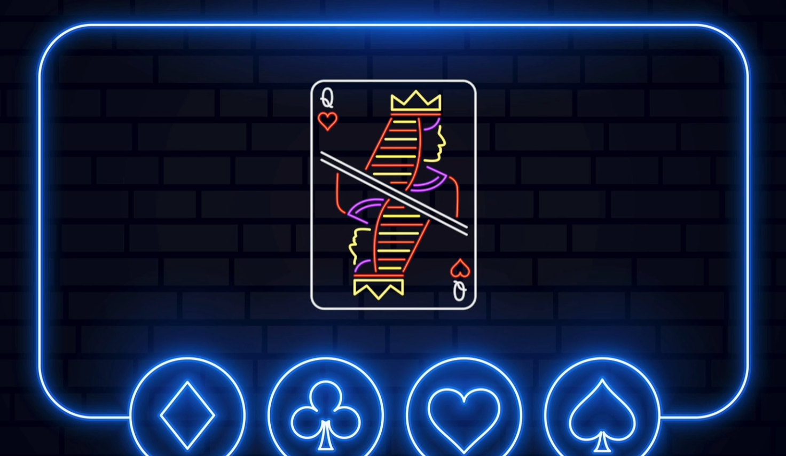

<a name="readme-top"></a>

[![Contributors][contributors-shield]][contributors-url]
[![Forks][forks-shield]][forks-url]
[![Stargazers][stars-shield]][stars-url]
[![Issues][issues-shield]][issues-url]
[![MIT License][license-shield]][license-url]
[![LinkedIn][linkedin-shield]][linkedin-url]

<!-- PROJECT LOGO -->
<br />
<div align="center">
  <a href="https://github.com/senabibi/Blackjack">
    
  </a>

<h3 align="center">Blackjack </h3>

  <p align="center">
     Blackjack game developed using the Python programming language. Blackjack, often referred to as "21," is a popular card game where players aim to achieve a higher hand value than the dealer but without exceeding a total hand value of 21.
    <br />
    <a href="https://github.com/senabibi/Blackjack"><strong>Explore the docs »</strong></a>
    <br />
    <br />
    <a href="https://github.com/senabibi/Blackjack">View Demo</a>
    ·
    <a href="https://github.com/senabibi/Blackjack/issues">Report Bug</a>
    ·
    <a href="https://github.com/senabibi/Blackjack/issues">Request Feature</a>
  </p>
</div>


<!-- TABLE OF CONTENTS -->
<details>
  <summary>Table of Contents</summary>
  <ol>
    <li>
      <a href="#about-the-project">About The Project</a>
      <ul>
        <li><a href="#built-with">Built With</a></li>
      </ul>
    </li>
    <li>
      <a href="#getting-started">Getting Started</a>
      <ul>
        <li><a href="#prerequisites">Prerequisites</a></li>
        <li><a href="#installation">Installation</a></li>
      </ul>
    </li>
    <li><a href="#usage">Usage</a></li>
    <li><a href="#roadmap">Roadmap</a></li>
    <li><a href="#contributing">Contributing</a></li>
    <li><a href="#license">License</a></li>
    <li><a href="#contact">Contact</a></li>
    <li><a href="#acknowledgments">Acknowledgments</a></li>
  </ol>
</details>


## About The Project

Here's a video demonstrating the Blackjack Simulator in action:
<p align="center">
  
</p>


Welcome to our Python-based Blackjack (21) game! This project is designed to bring the classic card game Blackjack to life in an engaging and interactive way. In Blackjack, the goal is to beat the dealer by having a hand value closer to 21 without going over. This project, developed in Python, adheres to Object-Oriented Programming (OOP) principles and offers a user-friendly console interface for easy gameplay. It simulates standard Blackjack rules and gameplay, allowing players to place bets, draw cards, and calculate winnings. It keeps track of player and dealer cards, hand values, and determines the winner. Feel free to explore the code and enjoy playing Blackjack!

<p align="center">
  
</p>


<p align="right">(<a href="#readme-top">back to top</a>)</p>

### Built With

* [![Python][Python.py]][Python-url]
* [![Replit][Replit.com]][Replit-url]


<p align="right">(<a href="#readme-top">back to top</a>)</p>

## Getting Started

This section provides instructions on how to set up and run the project locally. Please follow these steps to get your environment ready.

### Prerequisites

Before you begin, make sure you have the following prerequisites installed on your system:

* [Python](https://www.python.org/downloads/): You'll need Python to run this project.

* [Replit](https://replit.com): This project is designed to work with Replit, so you'll need to have a Replit account and be familiar with using it.

### Installation

Follow these steps to install and run the project:

1. **Python Installation:**
   - Download and install Python from the [official Python website](https://www.python.org/downloads/).

2. **Replit Usage:**
   - You can run this project on Replit by following these steps:
     - Create a Replit account if you don't have one.
     - Import the project into Replit or create a new Replit project.
     - Open the main Python script in Replit and run it.

Once you've completed these steps, you'll have Python and Replit set up and be ready to run the project locally.

<p align="right">(<a href="#readme-top">back to top</a>)</p>


## Usage

To use this project, follow these steps to set up your environment and develop the Blackjack game.

1. **Python Installation:**
   - Make sure you have the latest version of Python installed on your system. If it's not installed, you can download and install it from the [official Python website](https://www.python.org/downloads/).

2. **Starting the Game:**
   - To run the project, open your terminal or command prompt, navigate to the project's main directory, and run the following command:
     ```
     python blackjack.py
     ```
   - This command will start the game and allow you to play it through the console.

3. **Game Rules:**
   - To understand the rules of the Blackjack game, you can visit the [Blackjack Rules](https://www.blackjackapprenticeship.com/) page.

4. **Developing the Game:**
   - You can explore and modify the project's source code to customize the game and add new features.

5. **More Information:**
   - For additional examples and detailed information about the Blackjack game, refer to the [Documentation](https://www.treasury.tas.gov.au/Documents/Blackjack%20Rules%20-%201%20October%202018%20-%20Current.pdf) page.

This usage guide provides basic information on how to play the Blackjack game and outlines the essential steps to develop your project further. You can delve into the project's source code to tailor and expand your game.


## Roadmap

- [ ] Python Installation: Make sure you have the latest Python version installed for project development.
- [ ] Project Setup: Set up your project environment, and consider using a development platform like Replit for ease of development.
- [ ] Understanding OOP: Get acquainted with Object-Oriented Programming (OOP) concepts, as they are fundamental to this project. You can refer to resources like [Wikipedia's OOP page](https://en.wikipedia.org/wiki/Object-oriented_programming) or [W3Schools](https://www.w3schools.com/python/python_classes.asp) to learn OOP in Python.
- [ ] Feature 1: Begin by implementing the core functionality of the Blackjack game, including player interactions and card handling.
- [ ] Feature 2: Enhance the game by adding more features such as betting, scoring, and different playing strategies.
- [ ] Feature 3: Implement advanced game mechanics like splitting, doubling down, and insurance.
    - [ ] Sub-Feature: Develop a feature for users to view their game statistics and history.

You can also check out the [open issues](https://github.com/senabibi/Blackjack/issues) for a full list of proposed features and known issues.

This roadmap provides a step-by-step plan for the development of your Blackjack project, covering everything from essential setup to advanced gameplay features.


<p align="right">(<a href="#readme-top">back to top</a>)</p>


## Contributing

Contributions are what make the open-source community such an amazing place to learn, inspire, and create. Any contributions you make are **greatly appreciated**.

If you have a suggestion that would make this project better, please fork the repository and create a pull request. You can also simply open an issue with the "enhancement" tag.
Don't forget to give the project a star! Thanks again!

1. Fork the Project
2. Create your Feature Branch (`git checkout -b feature/AmazingFeature`)
3. Commit your Changes (`git commit -m 'Add some AmazingFeature'`)
4. Push to the Branch (`git push origin feature/AmazingFeature`)
5. Open a Pull Request

<p align="right">(<a href="#readme-top">back to top</a>)</p>


## License

Distributed under the MIT License. See `LICENSE.txt` for more information.

<p align="right">(<a href="#readme-top">back to top</a>)</p>


## Contact

Nursena Bitirgen - [LinkedIn](https://www.linkedin.com/in/nursena-bitirgen-5743341b9/)

Project Link: [https://github.com/senabibi/Blackjack](https://github.com/senabibi/Blackjack)

<p align="right">(<a href="#readme-top">back to top</a>)</p>


## Acknowledgments

The development of this project was made possible thanks to the following resources and skills:

* **Python Knowledge:** Special thanks to the Python programming language for its robust and versatile capabilities.
* **OOP Expertise:** Acknowledgment to the world of Object-Oriented Programming (OOP) for providing a solid foundation for this project.
* **Data Structure Proficiency:** Gratitude for the knowledge of data structures, which played a crucial role in shaping this project.
* **Replit Proficiency:** The ability to work with Replit was instrumental in the development of this project.

<p align="right">(<a href="#readme-top">back to top</a>)</p>


<!-- MARKDOWN LINKS & IMAGES -->
<!-- https://www.markdownguide.org/basic-syntax/#reference-style-links -->
[contributors-shield]: https://img.shields.io/github/contributors/senabibi/Blackjack.svg?style=for-the-badge
[contributors-url]: https://github.com/senabibi/Blackjack/graphs/contributors
[forks-shield]: https://img.shields.io/github/forks/senabibi/Blackjack.svg?style=for-the-badge
[forks-url]: https://github.com/senabibi/Blackjack/network/members
[stars-shield]: https://img.shields.io/github/stars/senabibi/Blackjack.svg?style=for-the-badge
[stars-url]: https://github.com/senabibi/Blackjack/stargazers
[issues-shield]: https://img.shields.io/github/issues/senabibi/Blackjack.svg?style=for-the-badge
[issues-url]: https://github.com/senabibi/Blackjack/issues
[license-shield]: https://img.shields.io/github/license/senabibi/Blackjack.svg?style=for-the-badge
[license-url]: https://github.com/senabibi/Blackjack/blob/master/LICENSE.txt
[linkedin-shield]: https://img.shields.io/badge/-LinkedIn-black.svg?style=for-the-badge&logo=linkedin&colorB=555
[linkedin-url]: https://www.linkedin.com/in/nursena-bitirgen-5743341b9/
[product-screenshot]: images/logo.png

[Python.py]: https://img.shields.io/badge/Python-3776AB?style=for-the-badge&logo=python&logoColor=white
[Python-url]: https://docs.python.org/3/

[Replit.com]: https://img.shields.io/badge/replit-667881?style=for-the-badge&logo=replit&logoColor=white
[Replit-url]: https://replit.com/
